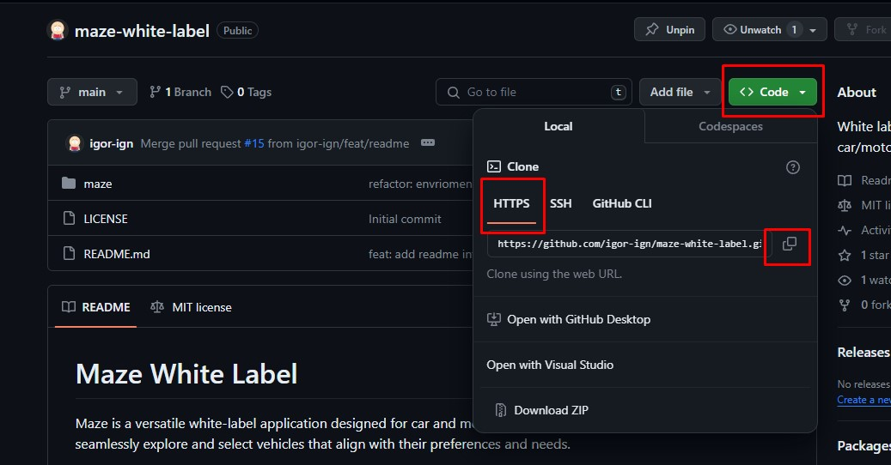
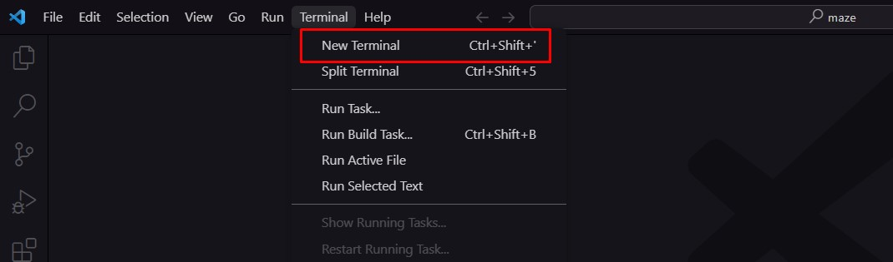
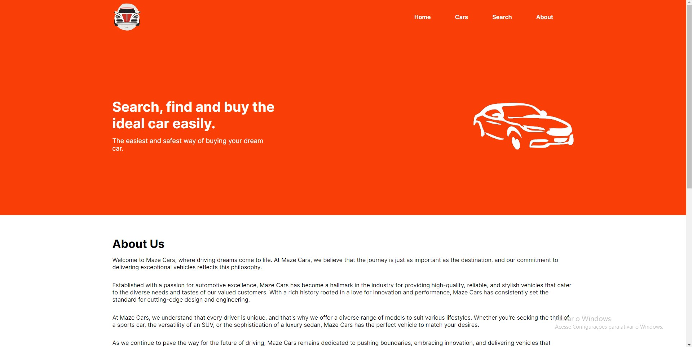
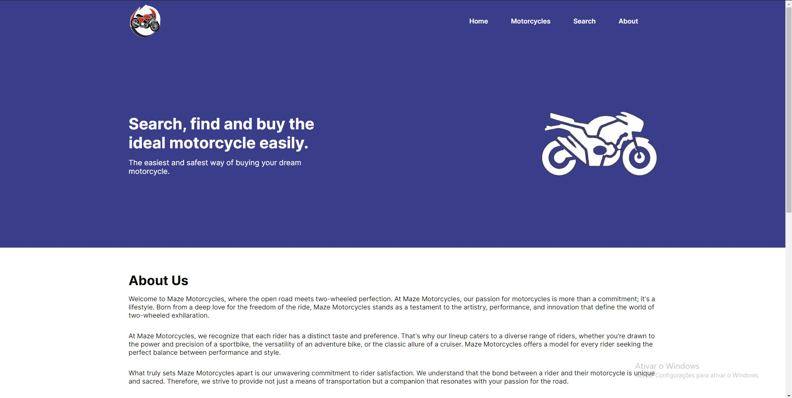
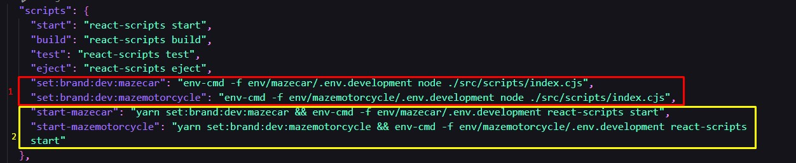
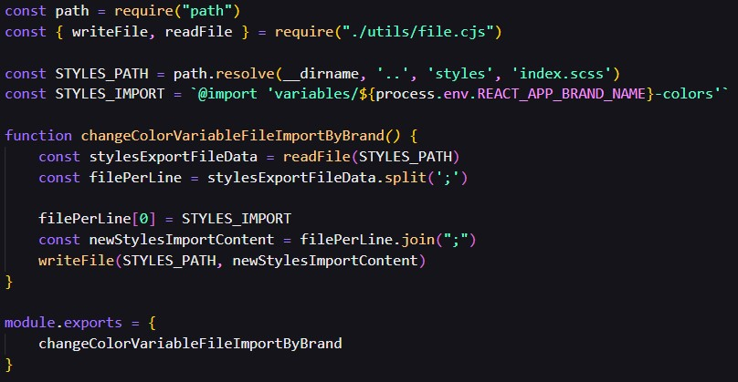
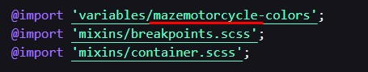
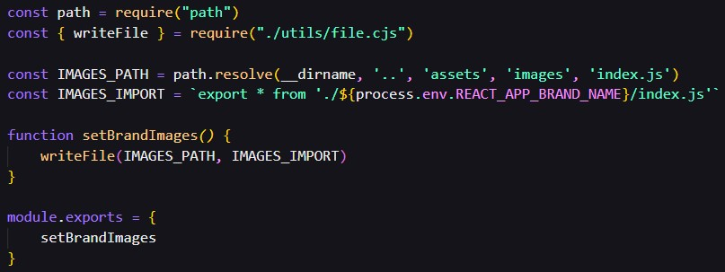
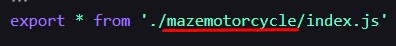

# Maze White Label

Maze is a versatile white-label application designed for car and motorcycle selling brands. With Maze, users can seamlessly explore and select vehicles that align with their preferences and needs.

## What you'll see in this readme:

- [Introduction](#introduction)
- [How to Run Maze](#how-to-run-maze)
- [How the White Label Works](#how-the-white-label-works)
- [Project Structure](#project-structure)
- [Coding Patterns and Adopted Practices](#coding-patterns-and-adopted-practices)

## Introduction

Developing feature-rich websites for multiple brands often involves significant time, resources, and technical expertise. With a white label application developers can create two or more websites with a single codebase. This approach not only saves time but also enhances scalability for businesses that may need to expand their online presence in the future.

A white label application is a pre-built software solution that can be rebranded and customized by businesses to suit their specific needs. If a company is owner of multiple brands it can create multiple websites with less money and way faster because the developers just need to code once because the code structure is basically the same for all websites. The downside of it is that if you have multiple websites they will have the same structure and the only difference between them are the texts, images and colors so the customization of those websites is more limited. The advantage of this kind of solution is that you need less developers, the codebase is easier to maintain compared to maintaining multiple websites with different codebases and this solution allow better scalability because if the company create or buy another brand you just need to add the texts, images and colors specific to that new brand to the code.

The idea behind this white-label application is to solve the problem of a company called Maze which wants a car selling and a motorcycle selling website. The company want a solution that doesn't involve many resources and a scalable solution because they may expand the Maze ecosystem in the future.

## How to Run Maze

Don't let the white-label thing scare you, running maze is as simple as running a regular application, in this section I'll guide you through this process.

**Project Dependencies:**

- ReactJS
- Typescript
- SASS
- NodeJS **(use V16.16.0 or higher)**

**Project Libraries:**

- React Router
- Axios
- Material UI
- Json Server

Before starting the installation process make sure that your NodeJS version is 16.16.0 or higher. If you don't know how to manage the node versions I strongly recommend you to download [NVM (Node Version Manager)](https://github.com/coreybutler/nvm-windows). If you don't know which NodeJS version you are using right now you should write `node -v` in the command prompt.

First things first, you need to clone the project. (I'm considering you use VSCode as your code editor)

1. At the top of the page you should click the green "<> code" button.
2. Select "https" and click in the button located to the right of the link in order to copy the project's url.



3. Open VSCode, select "terminal" and then "new terminal".



4. When the terminal is opened, you should type the following and press enter in order to download all the project dependencies and libraries: `yarn install` or the short one `yarn`. This process of downloading all the dependencies will not take long depending on your computer.
5. Now you'll need two terminals: one to run the project and other one to run the json server so the website lists can be fullfiled with data from a "fake api".
6. Starting with the json server, you'll need to type in one of the terminals you have opened: `npx json-server --watch db.json --d 3000 --port 3001`.

You use "--watch {file}" to specify the file where json server should get the "api" data and "--d {milliseconds}" to specify how long the json server should take (a.k.a the delay) to give you the response data. I recommend you to use this delay so the website look like a real world application where the API often take some seconds to answer your request. **Also, json server runs in the port 3000 by default so it is important to use the `--port 3001` flag to specify that the json server port is 3001 so it avoid conflicts with ReactJS which runs the app in the port 3000**

7. In the second terminal, which is not beeing used yet, you can type two different commands to start the application:

`yarn start-mazecar`
or
`yarn start-mazemotorcycle`

The first command line will start the car selling brand "Maze Car" website, the second one will start the motorcycle selling brand "Maze Motorcycle" website. You will understand better how json server and the white label scripts work in the next sections of this readme.

**Important:** you can't run `yarn start-mazecar` and `yarn start-mazemotorcycle` at the same time, if you are running one of them and want to run the other you need to stop the current and start the one you want to execute.

If you execute `yarn start-mazecar` you will see this initial page:



If you execute `yarn start-mazemotorcycle` you will see this initial page:



## How The White Label Works

Customizing the white label for this project is a straightforward process, and this section explains the technical details of this process.

### Environment Variables and Brand Configuration

The white label functionality relies on two main components:

1. **Changing Environment Variables:**

   - Update environment variables to correspond to the desired brand.
   - Use scripts in the `package.json` file to set the environment folder the application will use.

   

   - The scripts inside the red square determine which env folder the application will look at. For example, `yarn start-mazecar` uses the `env/mazecar` folder.

   - The scripts in the yellow square initiate the application. (`yarn start-mazecar` and `yarn start-mazemotorcycle` as you saw before in this readme)

### Brand-specific Images and Style Colors

To customize brand-specific images and style colors, the application is using two scripts located in the `src/scripts` folder:

1. **`set-colors.cjs` Script:**

   - Changes the import keyword of the color variable file inside `src/styles/index.scss`. For example, running `yarn start-mazecar` will import "@import 'variables/mazecar-colors';".

   
   

2. **`set-images.cjs` Script:**
   - Change which images are exported by the `src/assets/index.js` file. In this case I'm changing the exports to get the logo, banner image and the images of the "brands that we work with" section of each brand.

   
   

## Project Structure

The project follows a well-organized folder structure to enhance readability and maintainability. Here's an overview of the main directories and their purposes:

```text
├── /env # Project enviroment variables
│   	├─ /mazecar 
│       └── /mazemotorcycle
│ 		
├── /public # Public assets (HTML, Favicon, etc..)
├── /src # Application source code
│    ├── /assets # Images and Icons
│    │        ├─ /images 
│    │        │   ├─ /mazecar
│    │	      │	  └── /mazemotorcycle
│    │	      └── index.js
│    ├── /components # Components used throughout the project
│    │        ├─ /component1
│    │        │	    ├─ index.tsx
│    │	      │	    └── index.scss
│    │ 	      └── index.ts
│    ├── /constants # Global constant variables
│    │        ├─ constant1.ts
│    │ 	      └── index.ts
│    ├── /hooks # Custom hooks
│    │        ├─  use-request.ts
│    │ 	      └── index.ts
│    ├── /interfaces # Global interfaces and types
│    │        ├─ interface1.ts
│    │ 	      └── index.ts
│    ├── /pages # Main application pages
│    │        ├─ /main 
│    │        │    ├─ /components # Components specific to the page
│    │        │    │	   ├─ /component1
│    │        │    │	   └── index.ts
│    │	      │    ├─ /interfaces # Interfaces and types specific to the page
│    │        │    │	   ├─ interface1.ts
│    │        │    │	   └── index.ts
│    │	      │    ├─ /utils # Util functions specific to the page
│    │        │    │     ├─ util1.ts
│    │        │    │     └── index.ts
│    │        │    ├─ index.tsx
│    │        │    └── styles.scss
│    │        │     
│    │        └── index.ts
│    ├─ /scripts # White label scripts
│    │ 	   └── index.ts
│    ├─ /styles # Color variables and sass mixins
│    │  	│   ├─ /mixins 
│    │          │   │	   ├─ breakpoints.scss
│    │	        │   │	   └── container.scss
│    │	        │   └── /variables	
│    │          │   	   ├─ mazecar-colors.scss
│    │	        │	   └── mazemotorcycle-colors.scss
│    │          └── index.scss
│    │
│    │
│    ├── index.scss # Global styles
│    └── index.tsx # ReactJS index page
│
├── db.json # Fake database where json-server will look at when you start it
├── json-server.json # Json-server configuration file
├── package.json # Node.js package file
├── tsconfig.json # Typescript configuration file
├── README.md # Project documentation
└── LICENSE # Project license file
```

Feel free to explore each directory to understand its specific role and contribution to the overall project structure.

## Coding Patterns and Adopted Practices

In this project, I'm following a set of coding patterns and best practices to ensure consistency while coding and a more organized code. This section will be used to talk about the code patterns and best practices I have decided to follow.

### Conventional Commits

To maintain a standardized and semantic versioning approach, I have adopted Conventional Commits for the project commit messages. Conventional Commits are a convention for writing commit messages in a consistent and structured manner, this pattern help us to generate a clear and meaningful changelog.

When commiting in this project the following format should be used:
```plaintext
<type>: <description>

Example:
feat: added user management page
refactor: changed header dimensions
fix: fixed user register form bug
```
  
### Import Order 

To maintain a well-organized codebase and enhance readability, this project adhere to a specific import order for our modules and components. The order is as follows:
```typescript
import { useState, useEffect } from 'react'; #1 - ReactJS imports
import { useParams } from 'react-router-dom';  #2 - Libraries
import ArrowBack from '@mui/icons-material/ArrowBackIosNew';
import ArrowForward from '@mui/icons-material/ArrowForwardIos';
import Image from '../../assets'; #3 - Project images and Icons
import { Header } from '../../components'; #4 - Global components 
import { CONSTANT_VARIABLE } from '../../constants'; #5 - Global constants
import { useRequest } from '../../hooks';  #6 - Custom hooks
import { MyType, MyInterface } from '../../interfaces'; #7 - Global interfaces and types
import { InternalComponent } from './components'; #8 - Components specific to the page
import { INTERNAL_CONSTANT } from './constants'; #9 - Constant variables specific to the page
import { InternalInterface, InternalType } from './interfaces'; #10 - Interfaces specific to the page
import { InternalUtil } from './utils'; #11 - Util functions to the page
import ./style.scss #12 - Page styles

```
  
Key points of the import order:
1. This import order applies consistently to all modules and components, ensuring a unified structure.
2. ReactJS imports are placed at the beginning to emphasize their importance as the foundation of our components.
3. The import for styles (./style.scss) is positioned last to maintain a clear separation between dependencies and styling.

### Simplified Imports

In order to simplify imports in this project I'm centralizing exports using dedicated `index.ts` files in each folder. Adopting centralized index files is a beneficial practice for maintaining a clean and efficient codebase in JavaScript/TypeScript projects, this technique simplifies import statements and offers several advantages like:
1. **Code Organization:** It helps in organizing and centralizing your exports. All related modules are grouped together in the index file, making it easier to locate and manage dependencies.
2. **Simplified Refactoring:** If you decide to change the internal structure of your modules or move files around, you only need to update the index file. This can simplify the process of refactoring and reduce the chances of breaking existing imports.

Example of how the simplified imports work:

```typescript
Instead of:
import { Header } from '../../components/header';
import { Footer } from '../../components/footer';

It will be:
import { Header, Footer } from '../../components';

Because of the centralized index.ts file:
export { Header } from './header'
export { Footer } from './footer'
```

### Component Organization

Each component in this project adhere to a organizational structure I have defined to enhance code readability and maintainability. Below you can see an overview of how the components are organized in terms of code:

```typescript
export function MyComponent({ prop1, prop2...}) {
// #1 - State variables
const [apiInfo, setApiInfo] = useState<ApiInfoResponse>({})
const [isApiLoading, setIsApiLoading] = useState<boolean>(false);
const [currentImageIndex, setCurrentImageIndex] = useState<number>(0);

// #2 - Library hooks and custom hooks
const { getCarDetails, getMotorcycleDetails } = useRequest();
const { id } = useParams()

// #3 - UseEffects
 useEffect(() => {
     async function getInfoFromApi() {
          setIsApiLoading(true)
          const { data } = await getApiData(Number(id))
          setApiInfo(data)
          setIsApiLoading(false)
     }

     getInfoFromApi()
 }, [])
}

// #4 - Functions
 function renderImageInfo() {
     if (!isApiLoading) {
         return ()
     }

     return <Loading />
 }
```

The key points of this structure are:

1. **Scalability:** The structure is designed to scale as the component evolves, making it easier to add new features and functionalities.
2. **Consistency:** Following this structure ensures consistency across all components in the project.

### Variable and Function Naming

Consistent and meaningful variable and function names are essential for code readability and maintainability for all projects independent on which programming language or technology you are using. This project follow specific naming conventions to ensure clarity and understanding across the codebase.

#### General Guidelines

1. **Descriptive and Clear Names:**
   - Choose names that clearly convey the purpose and functionality of the variable or function.

   ```typescript
   // Good example
   const userId = user.id;

   // Avoid
   const id = user.id
   ```
   ```typescript
   // Good example
   function calculateTotalPrice() {
       // function body
   }
   
   // Avoid
   function calculate() { # Calculate what? This function tell us nothing about its role.
       // function body
   }
   ```

2. **Uppercase name for Constants:**
   - Use uppercase for constant variables and separate words with underscores.

  ```typescript
   // Good example
   const MAX_COUNT = 100;
   
   // Avoid
   const maxCount = 100;
  ```

3. **Use "has" and "is" Prefix for Booleans:**
   - Prefix boolean variable names with "has" or "is", this is considered a good practice for naming boolean variables by multiple programming language communities.

   ```typescript
   // Good example
   const hasPermission = true;

   const isLoggedIn = false;

   // Avoid
   const permission = true;

   const loggedIn = false;
   ```
   
### SASS/CSS Patterns

Talking about styling, this project follows the RSCSS (Reasonable Standard for CSS Stylesheet) pattern, which provides a structured and maintainable way to organize our SASS/CSS code. This pattern encourages a modular and scalable architecture, making it easier to manage and read style files across the project.

RSCSS rely on three key points:

1. **Components:** A component is the container of all the elements of the UI. They are named with at least two words, using dash as substitute to spaces, for example: `.search-bar`, `.card-header`.
2. **Elements:** Elements are the pieces inside our components, they are selected using the CSS child selector `>`. Example of element selection:
   ```sass
   .card-header { # This is the component
      ...styles
      > .header-title { # This is our element!
         ...styles
      }
   }
   ```
3. **Variants:** They are the modifiers of our components and elements. Example:
      ```sass
   .card-header { # This is the component
      ...styles
      > .header-title { 
         ...styles

         &.-highlithed { # This is our variant!
            ...styles
         }
      }
   }
   ```

This project also rely on the kebab-case to name its CSS/SASS classes. Example:
```sass
// Good
.card-header {...}
.page-container {...}

// Avoid
.cardHeader {...}
.page_container {...}
```
